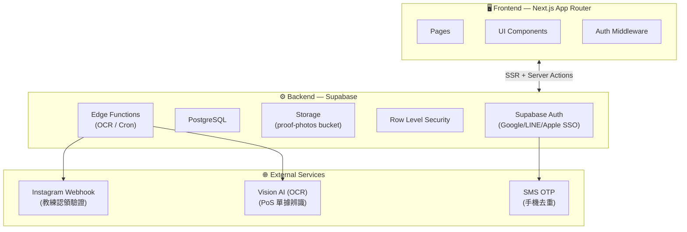
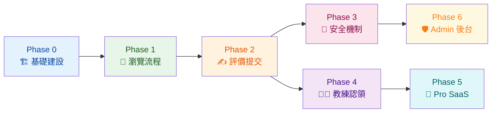
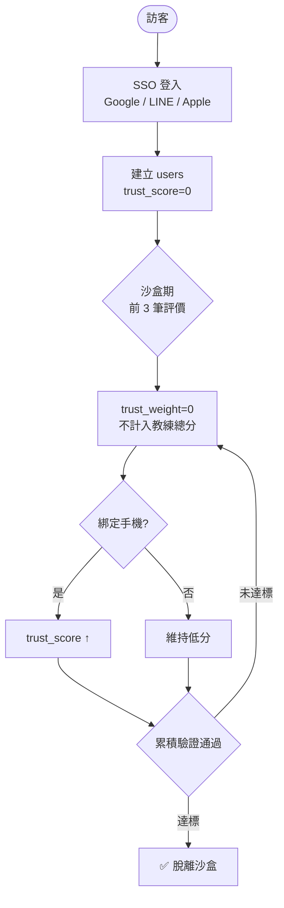
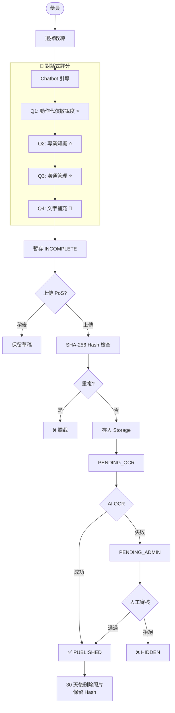
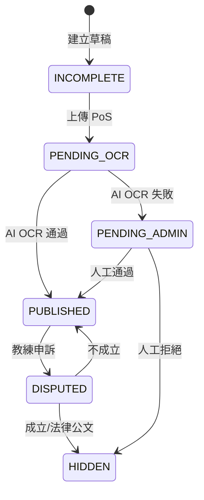
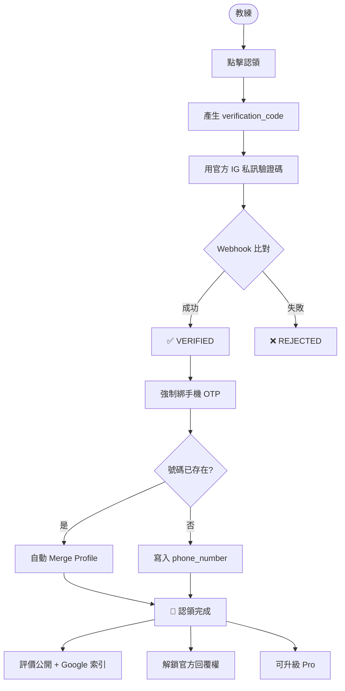
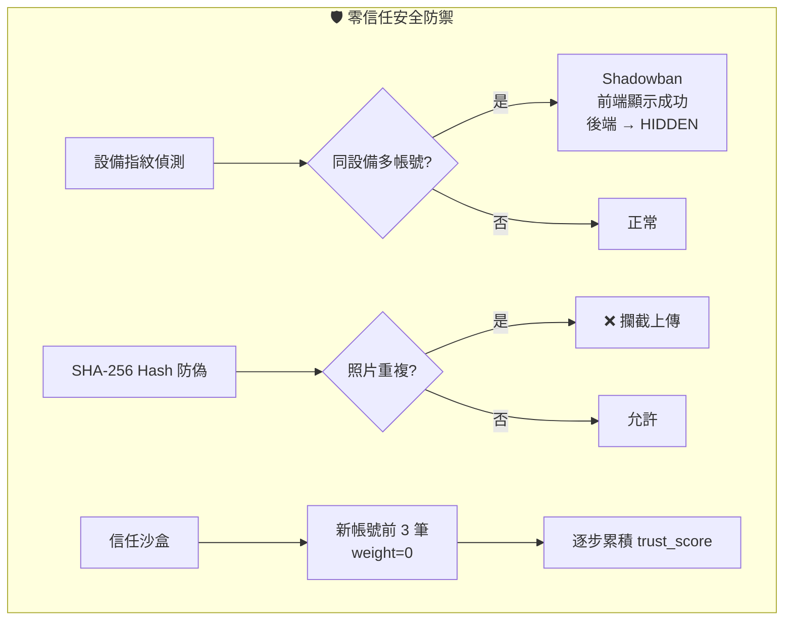
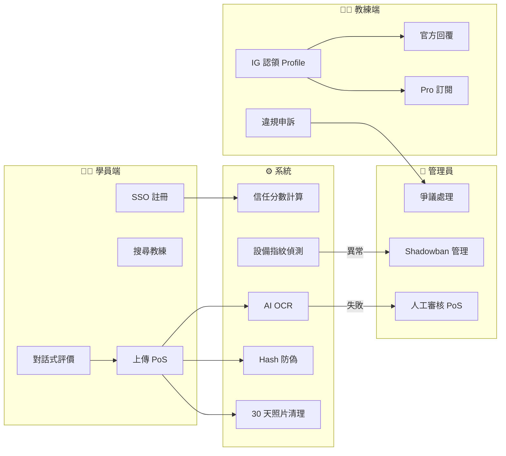
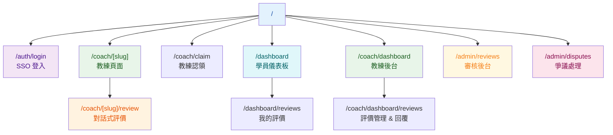

# 達達運動教練評估平台 — 架構流程圖總覽

> 所有圖表使用 Mermaid 語法，可在 GitHub、VSCode、Notion 等工具中預覽。

---

## 系統架構總覽

---

## 開發 Phase 路線圖

---

## 核心使用者流程

### 1. 學員註冊 → 信任建立

---

### 2. 對話式評價提交（核心流程）

---

### 3. 評價狀態機

---

### 4. 教練認領流程

---

### 5. 安全防禦體系

---

### 6. 三方角色互動總覽

---

## 頁面路由架構

---

## 目前開發進度

| Phase    | 名稱                                | 狀態            |
| -------- | ----------------------------------- | --------------- |
| Phase 0  | 基礎建設（設計系統、Auth、Layout）  | 🔲 尚未開始     |
| Phase 1  | 瀏覽流程（搜尋、教練頁、FOMO）      | 🔲 等待 Phase 0 |
| Phase 2  | 評價提交（Chatbot、PoS 上傳）       | 🔲 等待 Phase 1 |
| Phase 3+ | 安全機制、教練認領、Pro SaaS、Admin | 🔲 Backlog      |
