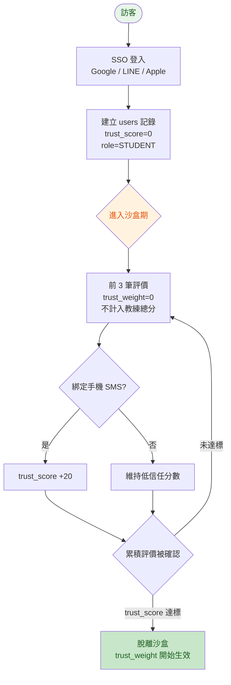
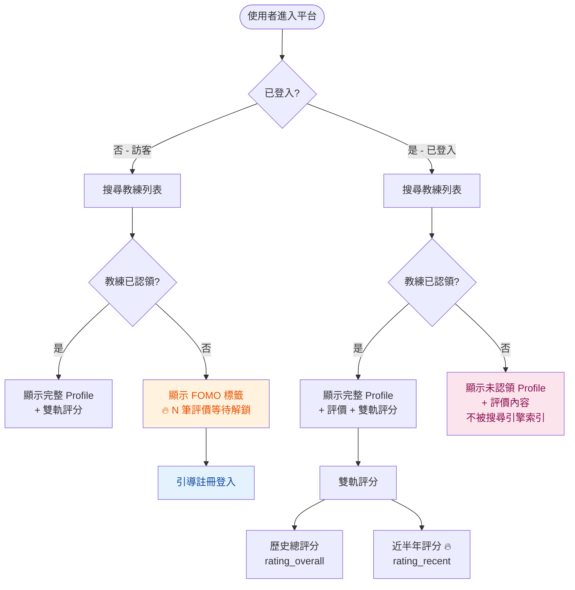
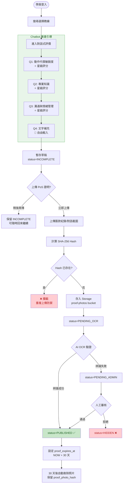
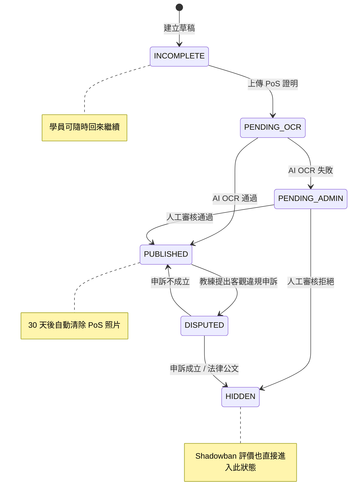
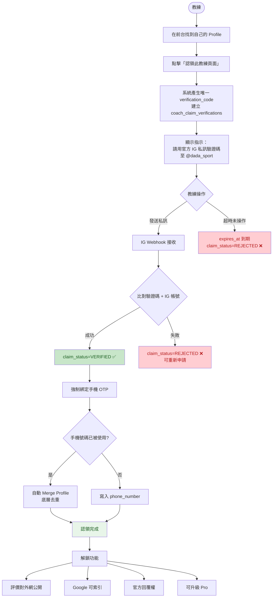
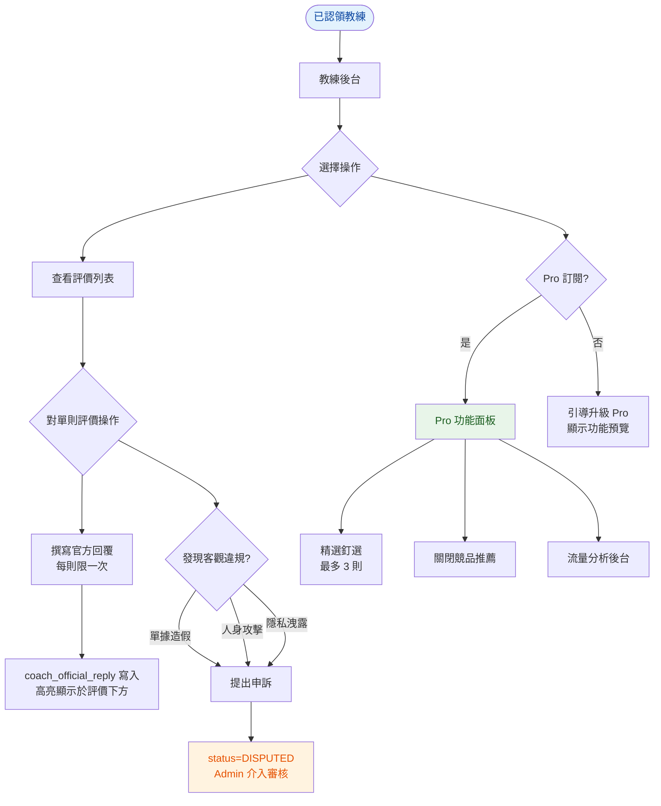
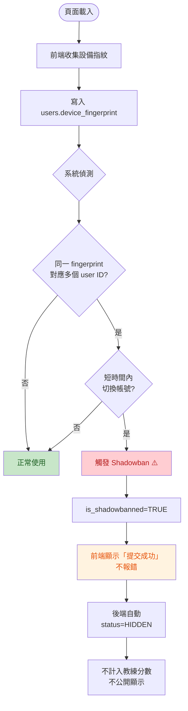
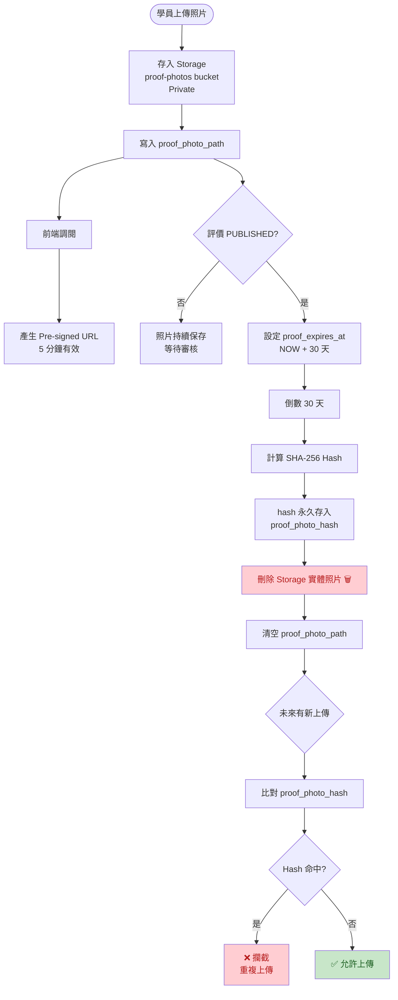
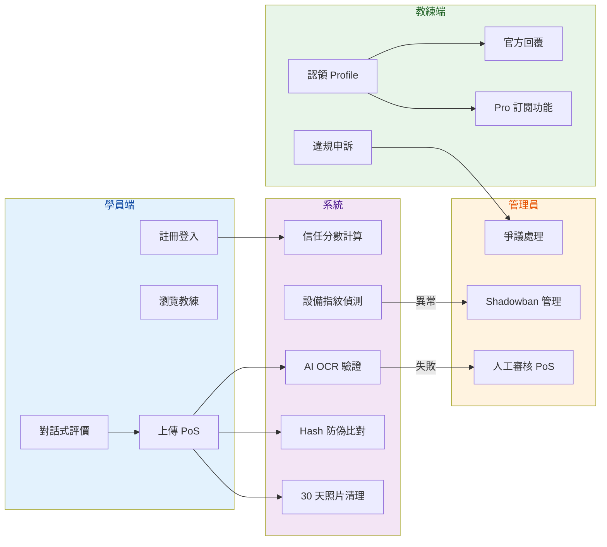

# 達達運動 — 使用者流程圖 (Mermaid)

> 所有流程的視覺化 Mermaid 圖表。可在 GitHub、VSCode 或任何支援 Mermaid 的工具中預覽。

---

## Flow 1：學員註冊與信任建立

---

## Flow 2：學員瀏覽教練（FOMO 機制）

---

## Flow 3：對話式評價提交（核心流程）

---

## Flow 3a：評價狀態機

---

## Flow 4：教練認領 Profile

---

## Flow 5：教練互動（回覆 & Pro 功能）

---

## Flow 6：設備指紋防禦 & Shadowban

---

## Flow 7：PoS 照片生命週期

---

## 全系統角色互動總覽

